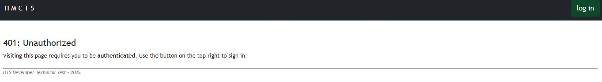
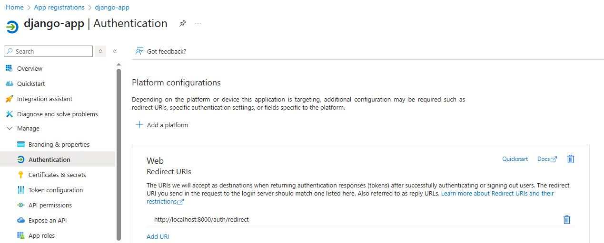
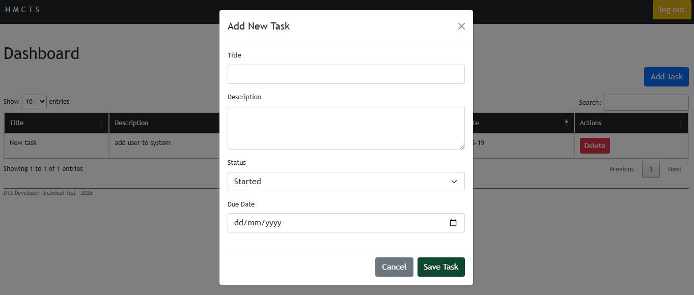

# DTS Developer Technical Test

## Backend

- **Framework**: Built using Django REST Framework
- **Database**: Data is stored in a MySQL Server database
- **Authentication**: All API endpoints require a valid token for access using jwt
- **Validation**: API Validation
- **API Endpoints**:  
  Below is a list of endpoints:

  - `POST api/token/` – Authenticate and retrieve token
  - `GET /api/tasks/` – List all tasks
  - `GET /api/tasks/<id>` – Get single task
  - `POST /api/task/` – Create new task
  - `PUT /api/tasks/<id>/` – Update task status
  - `DELETE /api/tasks/<id>/` – Delete task

- **Screenshots**:
  

---

## Frontend

- **Template Engine**: Built using Django Templates
- **Frontend frameworks**: Datatables, Bootstrap
- **Authentication**: Integrated with Azure SSO
- **Features**:

  - User-friendly interface with error handling & validation
  - uses backend api

- **End User Endpoint**:
  Below is the end user url

  - `http://localhost:8000/dashboard/` – Dashboard

- **Screenshots**:
  
  
  
  

---

## Testing

- **API Testing**: test cases implemented for all API endpoints
- **Run Tests**:
  ```cmd
  python manage.py test
  ```

---

## Setup Database

- Create mysql server database and enter credentials in settings.py

---

## Running app

- **Azure configuration**:

  - Register app in azure with redirect uri - http://localhost:8000/auth/redirect
  - Rename aad.config-template to aad.config.json
  - Enter tenant ID, Client ID and Client Secret in aad.config.json

- **Run following commands**:
  ```cmd
  pip install -r requirements.txt
  ```
  ```cmd
  python manage.py createsuperuser
  ```
  ```cmd
  python manage.py makemigrations
  ```
  ```cmd
  python manage.py migrate
  ```
  ```cmd
  python manage.py runserver
  ```
